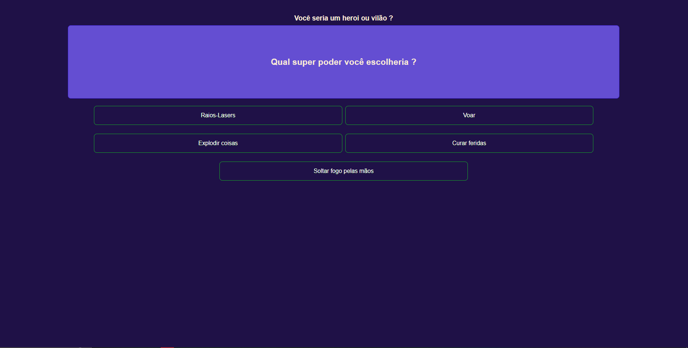

# Angular Quiz App

This project is a fun quiz app based on the BuzzFeed survey style. It allows users to answer a series of questions and provides a result based on their choices. If you are looking to explore Angular components, services, and user interactions, this project serves as a practical example.

## Project Structure

- **quiz.component.ts**: This file contains the implementation of the `QuizComponent`, an Angular component responsible for rendering quiz questions, options, and displaying the result based on user choices.

- **quiz.component.html**: The HTML template for the `QuizComponent`. It includes the layout for presenting quiz questions, options, and displaying the final result.

- **quiz_questions.json**: The JSON file that defines the quiz structure, including questions, options, and result messages.

## Project Running



## How to Use

1. Clone the repository to your local machine.
2. Open the project in your preferred Angular development environment.
3. Explore and modify the code to understand the implementation of quiz components and user interactions.
4. Run the application using the Angular CLI command: `ng serve`.
5. Open your browser and navigate to `http://localhost:4200/` to start taking the quiz and see the result.

## Getting Started

1. **Install Angular CLI**: If you haven't installed the Angular CLI, you can do so by running the following command in your terminal:

   ```bash
   npm install -g @angular/cli
    ```

2. **Install Dependencies**: Navigate to the project directory and install the project dependencies:

    ```bash
    npm install
    ```

3. **Run the Application**: Use the Angular CLI to run the application locally:

    ```bash
    ng serve
    ```

4. **Explore and Learn**: Review the code in each file to understand how Angular components handle quiz questions, options, and display the final result.

## Additional Notes

- Customize the quiz by modifying the quiz_questions.json file. Update questions, options, and result messages as needed.
- Have fun experimenting with the code, making changes, and enhancing the quiz app's functionality.
